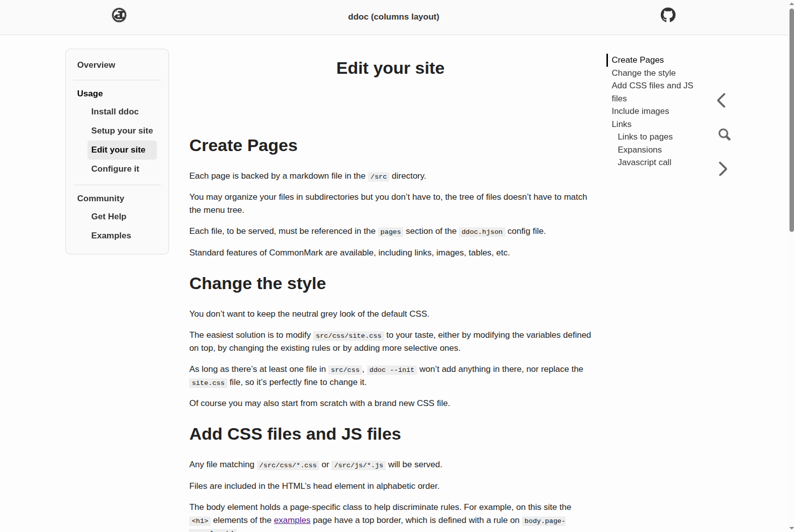
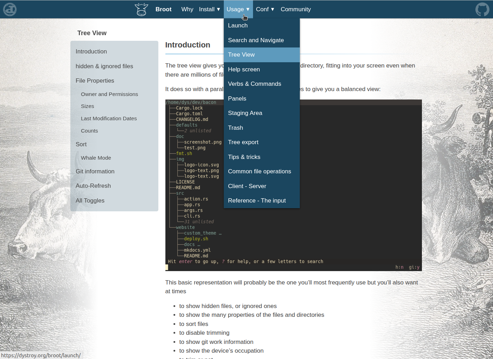

By looking at those sites and their sources, you may better see what's possible and how it's achieved.

# ddoc documentation

[ddoc's own documentation](https://dystroy.org/ddoc) is of course made with ddoc.

See the source at [https://github.com/Canop/ddoc/tree/main/website](https://github.com/Canop/ddoc/tree/main/website)

# ddoc columns example

[This example site](https://dystroy.org/ddoc-columns) features a different layout, with the site navigation permanentely visible on the left.

See the source at [https://github.com/Canop/ddoc/tree/main/examples/columns](https://github.com/Canop/ddoc/tree/main/examples/columns)

# bacon

bacon's website looks a lot like the one of ddoc, with different colors but the same layout.

website: [https://dystroy.org/bacon](https://dystroy.org/bacon)

Source: [https://github.com/Canop/bacon/tree/main/website](https://github.com/Canop/bacon/tree/main/website)

# broot

broot's website is similar to ddoc's too, but shows how a bigger documentation fits ddoc without problem.

broot uses additional scripts (in [/src/js](https://github.com/Canop/broot/blob/main/website/src/js/)) and stylesheets (in [/src/css](https://github.com/Canop/broot/blob/main/website/src/css/)) to highlight code and to group block codes and wrap them with tabs.

website: [https://dystroy.org/broot](https://dystroy.org/broot)

Source: [https://github.com/Canop/broot/tree/main/website](https://github.com/Canop/broot/tree/main/website)

# dysk

website: [https://dystroy.org/dysk](https://dystroy.org/dysk)

Source: [https://github.com/Canop/dysk/tree/main/website](https://github.com/Canop/dysk/tree/main/website)

