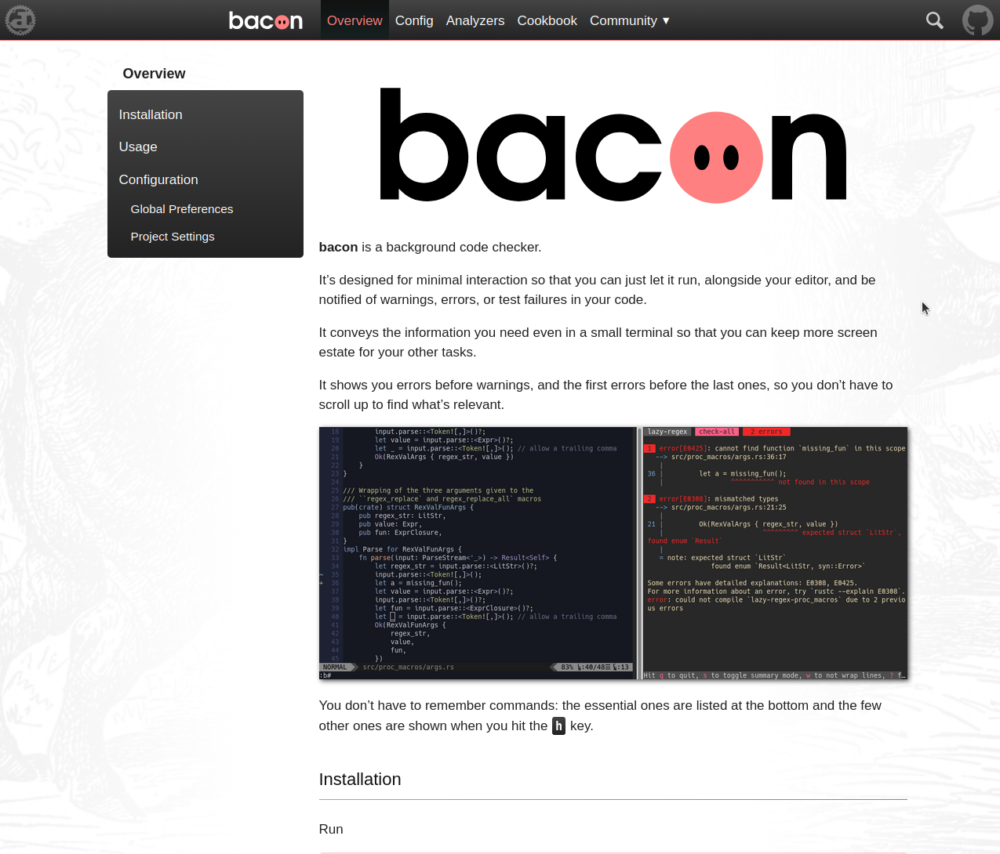
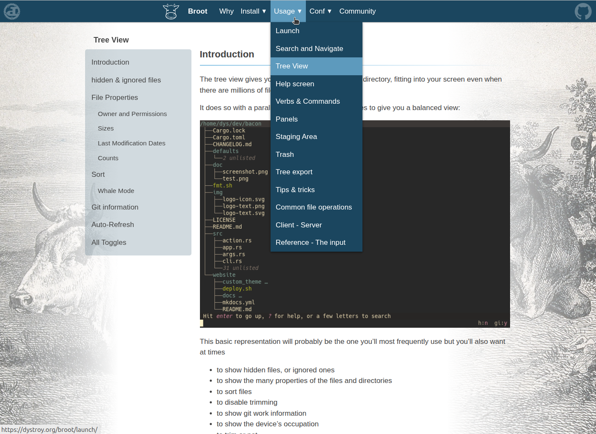
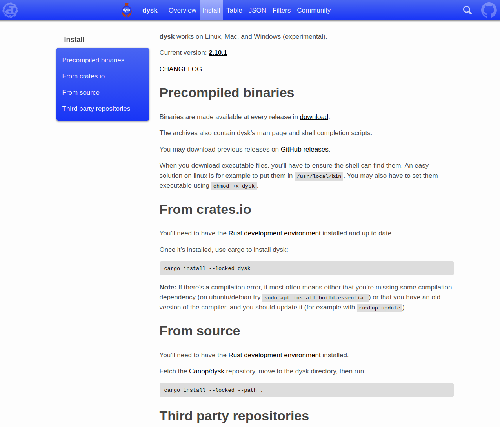

By looking at those sites and their sources, you may better see what's possible and how it's achieved.

# ddoc documentation

[ddoc's own documentation](https://dystroy.org/ddoc) is of course made with ddoc.

It uses the default `theme-columns` theming plugin and the feature plugins `search` and `toc-activate`.

[Source on GitHub](https://github.com/Canop/ddoc/tree/main/website)

# bacon

bacon's website uses the default `theme-top-menu` theming plugin.

website: [https://dystroy.org/bacon](https://dystroy.org/bacon)

[Source on GitHub](https://github.com/Canop/bacon/tree/main/website)

# broot

broot's website is similar to the bacon one. It shows how a bigger documentation fits ddoc without problem.

broot uses additional scripts (in [/src/js](https://github.com/Canop/broot/blob/main/website/src/js/)) and stylesheets (in [/src/css](https://github.com/Canop/broot/blob/main/website/src/css/)) to highlight code and to group block codes and wrap them with tabs.

website: [https://dystroy.org/broot](https://dystroy.org/broot)

[Source on GitHub](https://github.com/Canop/broot/tree/main/website)

# dysk

website: [https://dystroy.org/dysk](https://dystroy.org/dysk)

[Source on GitHub](https://github.com/Canop/dysk/tree/main/website)

